# Yuvashree Dhanasekaran — Personal Portfolio

> **Python Developer • AI & ML Enthusiast • Full-Stack Developer**

Welcome to my personal portfolio repository! ✨
This website is designed to showcase my **education, technical skills, professional experience, projects, certifications, resume, and ways to connect with me** in one place.

The portfolio focuses on a clean, modern, responsive interface while presenting my technical journey and practical work in an organized way.

---

## 🌐 Portfolio Overview

My portfolio represents my journey as a technology enthusiast with a strong interest in:

* 🐍 Python Development
* 🤖 Artificial Intelligence & Machine Learning
* 🌐 Full-Stack & Web Development
* 🧩 Application Development
* 🎨 UI / UX Design
* 💡 Creative Problem Solving

The website brings together both my **technical profile and personal interests**, giving visitors a complete view of my background beyond just a traditional resume.

---

## 🏠 Home

The Home section provides a quick introduction to my professional profile.

It highlights my identity as a **Python Developer & AI Enthusiast**, along with my key areas of interest:

* Python Full-Stack Development
* AI & Machine Learning
* Creative Thinking

It also provides quick navigation to my projects and contact section.

### Home Preview

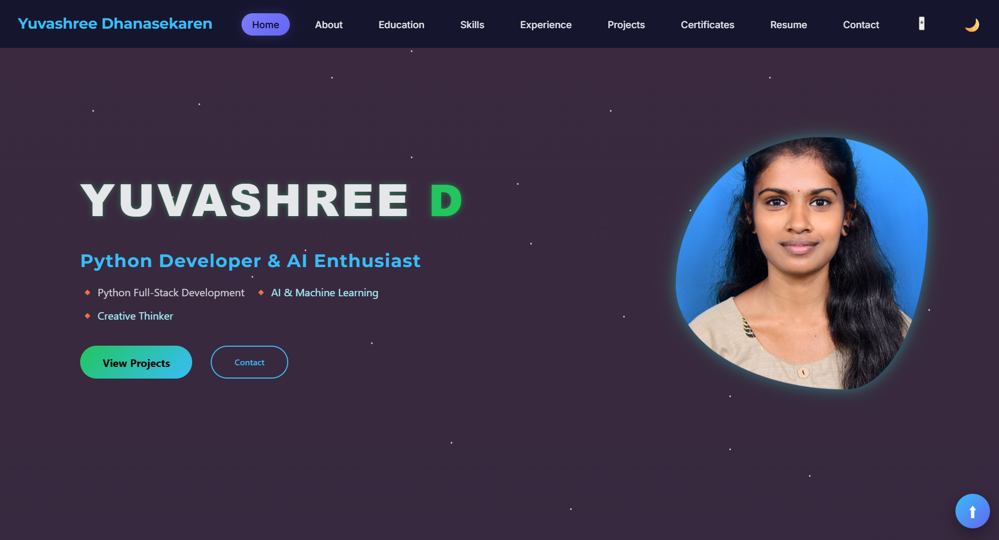

---

## 👩‍💻 About Me

The About section introduces my background, interests, technical direction, and personal qualities.

It highlights my experience with:

* Python
* Django
* MySQL
* Artificial Intelligence
* Machine Learning
* Application Development

It also reflects my personality as a **quick learner, flexible thinker, and creative problem solver**.

Beyond academics and technology, the portfolio also highlights my interests in **sports and classical dance**, which represent discipline, confidence, and consistency.

### About Preview

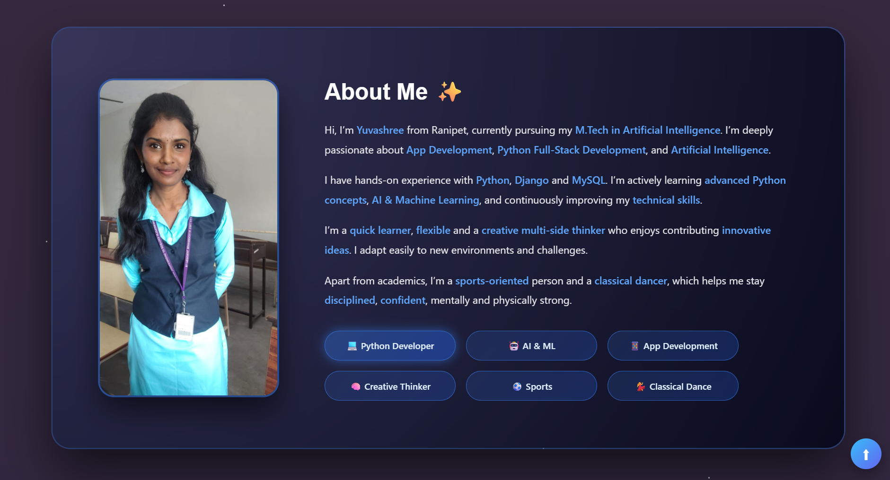

---

## 🎓 Education

The Education section presents my academic journey from school to higher education.

### Academic Journey

**M.Tech – Artificial Intelligence**
CMR University, Bangalore
Currently pursuing, with a focus on Artificial Intelligence, Machine Learning, and advanced technical concepts.

**B.Tech – Information Technology**
2022 – 2026
Er. Perumal Manimekalai College of Engineering, Hosur
Affiliated to Anna University
**CGPA: 8.05**

**Higher Secondary (HSC)**
2021 – 2022
Sunbeam School, Walaja
**Percentage: 70%**

**Secondary School (SSLC)**
2019 – 2020
NAG School, Walaja
**Percentage: 91%**

### Education Preview

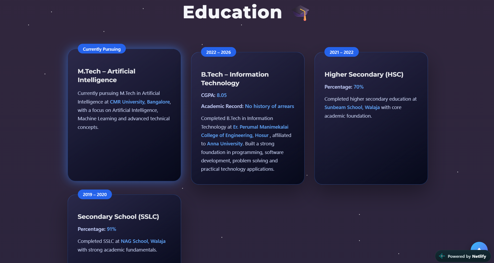

---

## 🛠️ Skills & Tools

The Skills section showcases the technologies, programming languages, frameworks, databases, development tools, and design tools I work with or have explored.

### Programming & Development

* Python
* C
* C++
* HTML
* CSS
* JavaScript
* JSON

### Frameworks & Technologies

* Django
* Flask
* Bootstrap
* Artificial Intelligence
* Machine Learning

### Databases

* MySQL
* MongoDB

### Development Tools

* Visual Studio Code
* PyCharm
* GitHub
* MySQL Workbench

### Design & Productivity

* UI / UX
* Figma
* Canva
* MS Excel
* Power BI
* Overleaf

### Skills Preview

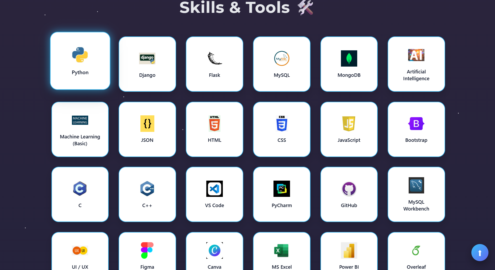

---

## 💼 Experience

The Experience section presents my internship experience and the practical exposure gained through different development environments.

### AI with Python Intern — Make Clouds

Completed an internship focused on **Artificial Intelligence with Python**, gaining practical exposure to Python programming, AI concepts, and hands-on development.

### Python Programming Intern — RD Infra Technology

Completed an internship focused on **Python programming**, gaining practical experience with programming concepts and application development.

### MERN Full Stack Intern — Global Quest Technology

Completed a **full-stack development internship** with exposure to frontend and backend development, web technologies, and full-stack application development.

Each experience includes access to the relevant company profile and work details through the portfolio.

### Experience Preview

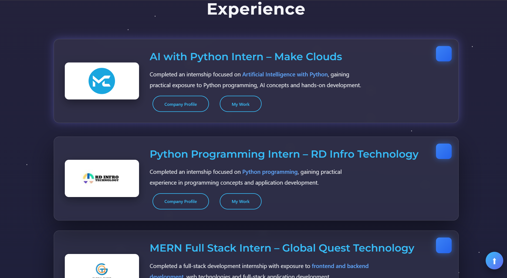

---

# 🚀 Projects

The Projects section is the main showcase of my practical development work.

Projects are organized through technology-based filters such as **AI, Flask, Django, and Web**, making it easier to explore projects based on their technology stack.

### Featured Projects

### 🤖 AI-Powered Real-Time Video Translation & Subtitling

An AI-based system designed to translate live video content and generate real-time subtitles using speech recognition and Natural Language Processing.

**Focus:** AI • Speech Recognition • NLP • Video Translation

---

### ✈️ Travel Booking Website

A responsive travel booking platform featuring authentication, forms, booking flows, and secure user management.

**Focus:** Web Development • Authentication • Forms • Booking System

---

### 🚨 Smart Accident Monitoring using AI & IoT

An AI and IoT-based accident detection system designed to identify accidents and automatically alert emergency services in real time.

**Focus:** Artificial Intelligence • IoT • Accident Detection • Emergency Alerts

---

### 👩‍💻 Personal Portfolio Website

A modern responsive portfolio website created to present my projects, skills, education, experience, certifications, and professional profile.

**Focus:** HTML • CSS • JavaScript • Responsive Web Design

---

### 👥 Employee Management System | Django

A Django-based employee management application featuring CRUD operations, authentication, and role-based access.

**Focus:** Django • Python • CRUD • Authentication

---

### 📄 AI-Powered Resume Screening

An AI-driven resume screening system designed to evaluate and rank candidates using Natural Language Processing and Machine Learning.

**Focus:** AI • NLP • Machine Learning • Resume Analysis

---

### 🎮 FunQuiz – Django Quiz Game

A single-player entertainment quiz web application built using Django with authentication, session-based scoring, and category-based gameplay.

**Focus:** Django • Authentication • Sessions • Quiz System

---

### ✅ To-Do List Application | Django

A task management application featuring authentication, task status handling, and a clean user interface.

**Focus:** Django • Authentication • Task Management

---

### 🎨 Responsive Landing Page UI Designs

A collection of responsive landing page layouts designed using modern UI/UX principles.

**Focus:** UI / UX • Responsive Design • Frontend Development

---

### 🖥️ SVG and Pure HTML, CSS Designs

A web design project focused on creating visually rich and responsive interfaces using SVG, HTML, and CSS.

**Focus:** SVG • HTML • CSS • Creative Web Design

### Project Preview

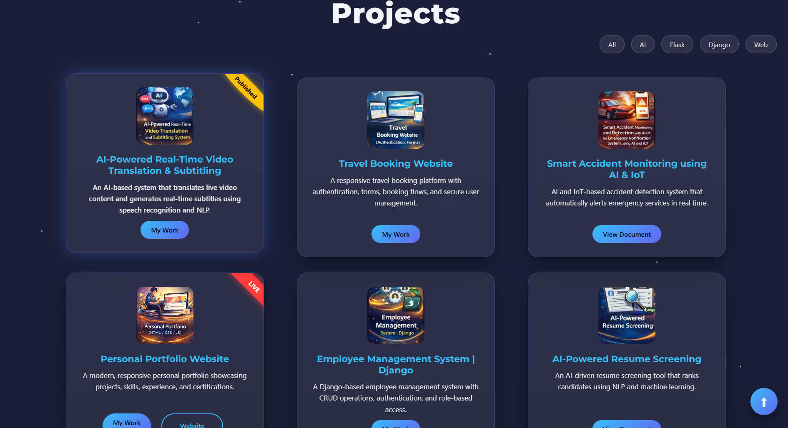

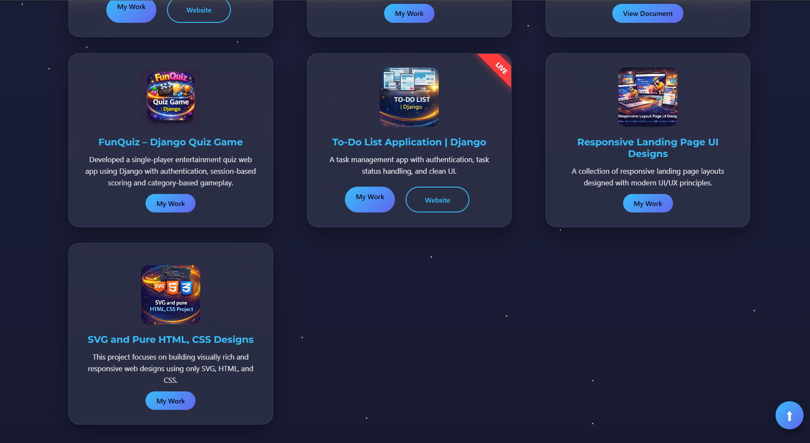

---

# 🏅 Certificates

The Certificates section presents certifications and learning achievements across different areas of technology.

### Internship & Training

* AI with Python — Bangalore
* Python Full Stack — Chennai
* AI & ML — Online
* MERN Full Stack — Bangalore

### Courses

* Master in Python Programming — Offline
* Machine Learning — NPTEL
* Basics of Data Analysis — Coursera
* UI/UX Design — Novi Tech
* Digital Marketing — Online

### Symposium Participation

* 6G Technology — PSV College
* Cloud Computing — GCE Bargur
* 6G Technology — PMC Tech College
* Blockchain Technology — PMC Tech College

### Certificates Preview

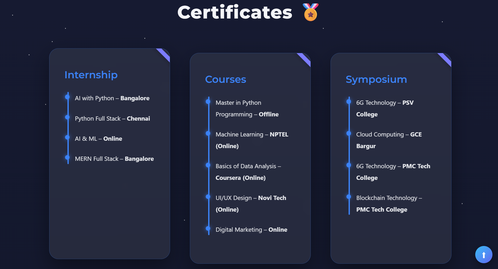
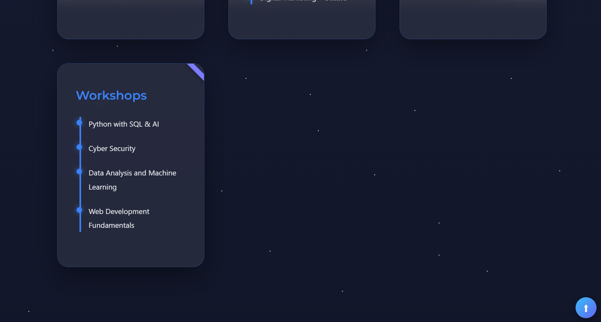

---

# 📄 Resume

The Resume section provides visitors with direct access to my professional resume.

Visitors can:

* 👀 View my resume
* 📥 Download my resume

The resume contains my academic background, technical skills, internships, projects, and other professional information.

### Resume Preview

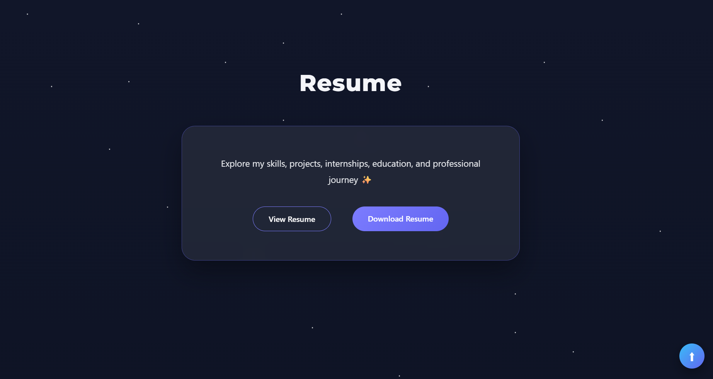

---

## 💼 My Professional Journey

A closer look at my journey, skills, and the work I’m passionate about.

My resume brings together my technical experience, projects, internships, education, and continuous learning — all in one place.

✨ **Explore my professional journey and discover what I can build.**

[🔗 View My Resume](https://subtle-cheesecake-01abe0.netlify.app/)

---

# 🤝 Let's Connect

The Contact section provides a simple way for visitors to get in touch with me.

It includes:

* Name
* Email
* Message
* Direct social/contact links
* WhatsApp sharing option

The section is designed to make professional communication simple and accessible.

### Contact Preview

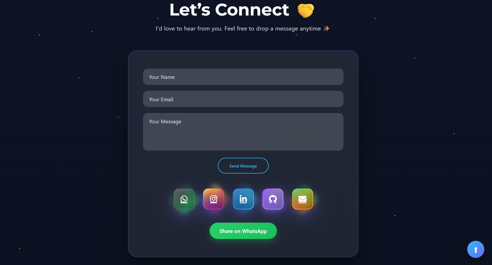

---

# 🎯 Portfolio Goals

This portfolio is more than a collection of webpages. It represents my continuous journey of learning, building, and improving as a developer.

Through this portfolio, I aim to:

* Build practical software projects
* Strengthen Python and full-stack development skills
* Explore Artificial Intelligence and Machine Learning
* Improve problem-solving abilities
* Experiment with creative UI/UX ideas
* Continuously learn new technologies
* Present my technical work professionally

---

# 🧰 Technology Areas

The portfolio and showcased projects cover a range of technologies including:

**Languages:**
Python • C • C++ • HTML • CSS • JavaScript

**Frameworks:**
Django • Flask • Bootstrap

**Databases:**
MySQL • MongoDB

**AI & Data:**
Artificial Intelligence • Machine Learning • Data Analysis

**Tools:**
GitHub • VS Code • PyCharm • MySQL Workbench

**Design:**
Figma • Canva • UI/UX

---

# 📱 Responsive Design

The portfolio is designed with responsiveness in mind so that its sections, cards, navigation, project layouts, and contact elements can adapt to different screen sizes.

The interface combines:

* Modern dark-themed design
* Responsive layouts
* Interactive navigation
* Project filtering
* Structured information cards
* Visual project presentation
* Resume access
* Contact integration

---

# ✨ Design Approach

The portfolio follows a **modern dark-themed visual style** with glowing accents, rounded cards, clean typography, and structured sections.

Rather than presenting information like a traditional resume, the design aims to create a more interactive experience where visitors can explore different parts of my profile naturally.

The goal is to balance **professional presentation, technical information, and personal creativity**.

---

# 📂 Portfolio Sections

The complete portfolio is organized into:

**Home → About → Education → Skills → Experience → Projects → Certificates → Resume → Contact**

Each section has its own purpose while maintaining a consistent visual identity throughout the website.

---

# 👩‍💻 About the Developer

**Yuvashree Dhanasekaran**

Python Developer & AI Enthusiast
M.Tech in Artificial Intelligence — CMR University, Bangalore

Interested in building practical applications, exploring AI technologies, developing full-stack solutions, and turning creative ideas into working software.

---

## 💙 Closing Note

This portfolio reflects my current skills, learning journey, practical experience, and projects.

I believe that development is a continuous process of **learning, experimenting, building, and improving** — and this portfolio will continue to evolve along with that journey.

**Turning ideas into code.
Designed & developed with passion. 💗**
